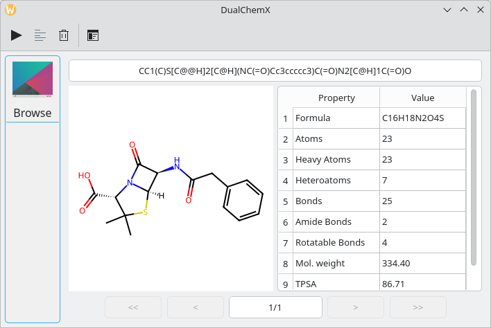
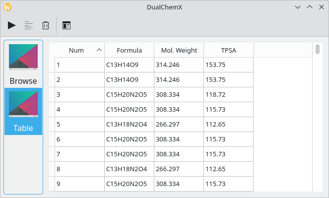
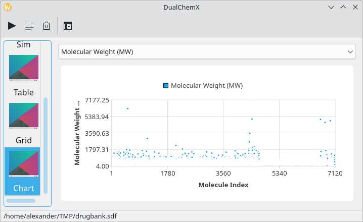

# dualchemx

DualChemX - open-source 2D chemical viewer (Python, Qt, PySide, RDKit).

Features:  
 - supported formats: SDF, SMILES  
 - molecular descriptors  
 - visual representation: table, chart, molecular grid  

License: GNU GENERAL PUBLIC LICENSE Version 3 (GPL-3.0-only)  
Source code: https://github.com/dualword/dualchemx  

